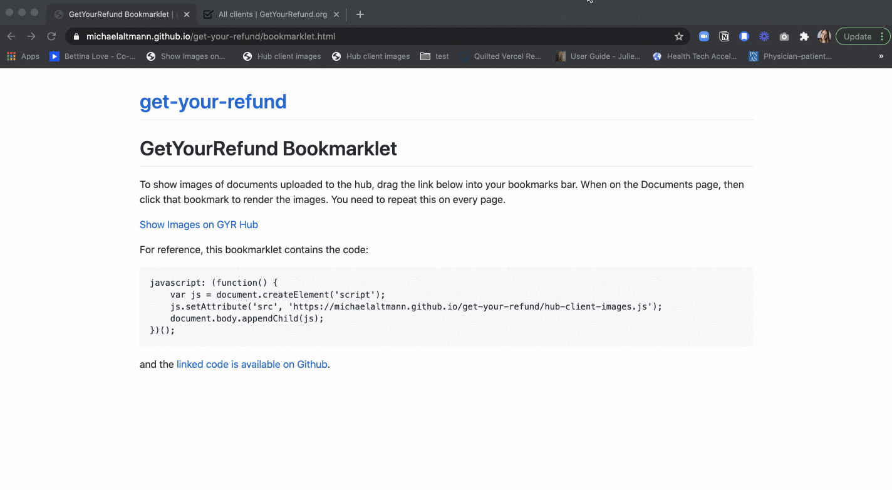

# GetYourRefund Image Bookmarklet

<style>
a.button-link {
  background-color: darkgray;
  color: white;
  padding: 14px 25px;
  text-align: center;
  text-decoration: none;
  display: inline-block;
}

</style>

To show images of documents uploaded to the hub, drag the link below into your bookmarks bar. When on the Documents page, then click that bookmark to render the images. You need to repeat this on every page.

<a class='button-link'  href="javascript: (function() {
    var js = document.createElement('script');
    js.setAttribute('src', 'https://michaelaltmann.github.io/get-your-refund/hub-client-images.js');
    document.body.appendChild(js);
})();">Images Gallery on GYR Hub</a>



(Above GIF by Diana Laster)

For reference, this bookmarklet contains the code:

```
javascript: (function() {
    var js = document.createElement('script');
    js.setAttribute('src', 'https://michaelaltmann.github.io/get-your-refund/hub-client-images.js');
    document.body.appendChild(js);
})();
```

[See the code behind it on Github](https://github.com/michaelaltmann/get-your-refund).

# GetYourRefund Client Flagger Bookmarklet

This bookmarklet flags in blue, those clients that most greeters will want to avoid because they fall into one of the following categories

- Spanish speaking
- Virtial VITA (the inbox icon)
- Associated with a partner org that handling their own greeting.

Drag the link below to your bookmarks bar. Then when you are on the
list of clients, clck the bookmarks to flag those clients in blue.

<a class='button-link' href="javascript: (function() {
      var js = document.createElement('script');
      js.setAttribute('src', 'https://michaelaltmann.github.io/get-your-refund/hub-greeter-clients.user.js');
      document.body.appendChild(js);
  })();">Flag Clients on GYR Hub</a>

You can also set up TamperMonkey to run this whenever you visit the client page.
Install TamperMonkey in your browser and then visit
https://raw.githubusercontent.com/michaelaltmann/get-your-refund/gh-pages/hub-greeter-clients.user.js

## Testing locally

If you make modifications to the javascript code and want to test them locally,
start an http server in this directory that will server up the javascript file
with the right content-type. For example, with python run

```
python3 -m http.server 9000
```

Once you have a local server running, create a bookmarklet whose content is

```
javascript: (function() {
    var js = document.createElement('script');
    js.setAttribute('src', 'http://localhost:9000/hub-client-images.js');
    document.body.appendChild(js);
})();
```
