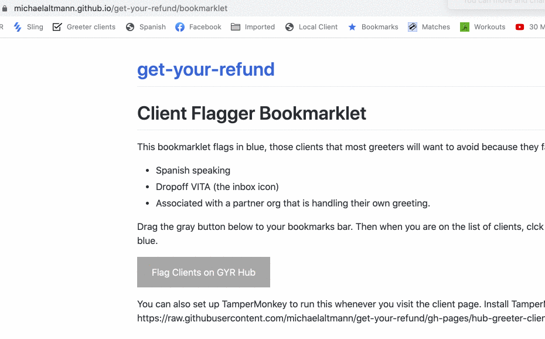

<style>
a.button-link {
  background-color: darkgray;
  color: white;
  padding: 14px 25px;
  text-align: center;
  text-decoration: none;
  display: inline-block;
}

</style>

# All bookmarklets

# All-in-one

Drag the gray button below to your bookmarks bar. When you want to use one of these bookmarklets, tap on the bookmark. This does not include the 'Take Action' bookmarklet as the Hub has changed since that was created.

<a class='button-link' href="javascript: (function() {
  var body = document.body;
  var common_avoid = document.createElement('script');
  common_avoid.setAttribute('src', 'https://michaelaltmann.github.io/get-your-refund/hub-greeter-clients.user.js');
  body.appendChild(common_avoid);
  var sp_avoid = document.createElement('script');
  sp_avoid.setAttribute('src', 'https://michaelaltmann.github.io/get-your-refund/hub-spanish-clients.user.js');
  body.appendChild(sp_avoid);
  var assign = document.createElement('script');
  assign.setAttribute('src', 'https://michaelaltmann.github.io/get-your-refund/hub-assign-selector.user.js');
  body.appendChild(assign);
  var imgs = document.createElement('script');
  imgs.setAttribute('src', 'https://michaelaltmann.github.io/get-your-refund/hub-client-images.js');
  body.appendChild(imgs);
  var img_edit = document.createElement('script');
  img_edit.setAttribute('src', 'https://michaelaltmann.github.io/get-your-refund/hub-doc-edit.user.js');
  body.appendChild(img_edit);
})();">GYR Hub All Bookmarklets</a>

## Each individually

Instead, you can use these bookmarklets one at a time. Drag the gray buttons that you want into your bookmarks bar. When you want to use one, tap on the appropriate bookmark.

Flag in blue those clients that most greeters will want to avoid serving because they need a Spanish speaker, are a dropoff VITA client, or are associated with a partner org that is handling their own greeting.
<a class='button-link' href="javascript: (function() {
  var js = document.createElement('script');
  js.setAttribute('src', 'https://michaelaltmann.github.io/get-your-refund/hub-greeter-clients.user.js');
  document.body.appendChild(js);
})();">Flag Clients on GYR Hub</a>

Like the above, but flip the language. Show only clients that list Spanish as their language. Hide clients that are dropoff VITA or associated with a partner org that is handling their own greeting.
<a class='button-link' href="javascript: (function() {
      var js = document.createElement('script');
      js.setAttribute('src', 'https://michaelaltmann.github.io/get-your-refund/hub-spanish-clients.user.js');
      document.body.appendChild(js);
})();">Spanish Clients on GYR Hub</a>

Assign or unassign yourself to a client without scrolling through the list of volunteers.
<a class='button-link' href="javascript: (function() {
      var js = document.createElement('script');
      js.setAttribute('src', 'https://michaelaltmann.github.io/get-your-refund/hub-assign-selector.user.js');
      document.body.appendChild(js);
})();">Assign Button on Hub</a>

See all images a client has submitted on their page. Does not handle PDFs.
<a class='button-link'  href="javascript: (function() {
    var js = document.createElement('script');
    js.setAttribute('src', 'https://michaelaltmann.github.io/get-your-refund/hub-client-images.js');
    document.body.appendChild(js);
})();">Images Gallery on GYR Hub</a>

Preview an image while you're editing it.
<a class='button-link' href="javascript: (function() {
      var js = document.createElement('script');
      js.setAttribute('src', 'https://michaelaltmann.github.io/get-your-refund/hub-doc-edit.user.js');
      document.body.appendChild(js);
})();">Image Preview on Edit</a>

---

# Each bookmarklet

Details about each bookmarklet individually.

## Client Flagger Bookmarklet
(English language)

This bookmarklet flags in blue, those clients that most greeters will want to avoid because they fall into one of the following categories

- Spanish speaking
- Dropoff VITA (the inbox icon)
- Associated with a partner org that is handling their own greeting.

Drag the gray button below to your bookmarks bar. Then when you are on the
list of clients, clck the bookmarks to flag those clients in blue.

<a class='button-link' href="javascript: (function() {
  var js = document.createElement('script');
  js.setAttribute('src', 'https://michaelaltmann.github.io/get-your-refund/hub-greeter-clients.user.js');
  document.body.appendChild(js);
})();">Flag Clients on GYR Hub</a>

You can also set up TamperMonkey to run this whenever you visit the client page.
Install TamperMonkey in your browser and then visit
https://raw.githubusercontent.com/michaelaltmann/get-your-refund/gh-pages/hub-greeter-clients.user.js

This animation shows how to do the installation


## Spanish Client Bookmarklet

This bookmarklet shows only those clients that list Spanish as their language of choice.
It also hides clients that are

- dropoff VITA or
- associated with a partner org that is handling their own greeting.

Drag the gray button below to your bookmarks bar. Then when you are on the
list of clients, clck the bookmarks to show just Spanish clients available for
greeters.

<a class='button-link' href="javascript: (function() {
      var js = document.createElement('script');
      js.setAttribute('src', 'https://michaelaltmann.github.io/get-your-refund/hub-spanish-clients.user.js');
      document.body.appendChild(js);
  })();">Spanish Clients on GYR Hub</a>

You can also set up TamperMonkey to run this whenever you visit the client page.
Install TamperMonkey in your browser and then visit
https://raw.githubusercontent.com/michaelaltmann/get-your-refund/gh-pages/hub-spanish-clients.user.js

## Assign to Me Bookmarklet

This bookmarklet adds a button to assign a client to yourself so you don't have to scroll through the list of assignees. It also moves you to the top of the assignee list and adds an unassign button if you are assigned.

Drag the gray button below to your bookmarks bar. Then when you are on the
list of clients, clck the bookmarks to add the assign button.

<a class='button-link' href="javascript: (function() {
      var js = document.createElement('script');
      js.setAttribute('src', 'https://michaelaltmann.github.io/get-your-refund/hub-assign-selector.user.js');
      document.body.appendChild(js);
  })();">Assign Button on Hub</a>

You can also set up TamperMonkey to run this whenever you visit the client page.
Install TamperMonkey in your browser and then visit
https://raw.githubusercontent.com/michaelaltmann/get-your-refund/gh-pages/hub-assign-selector.user.js

## Image Gallery Bookmarklet

To show images of documents uploaded to the hub, drag the gray button below into your bookmarks bar. When on the Documents page, tap that bookmark to render the images. You need to repeat this on every page.

<a class='button-link'  href="javascript: (function() {
    var js = document.createElement('script');
    js.setAttribute('src', 'https://michaelaltmann.github.io/get-your-refund/hub-client-images.js');
    document.body.appendChild(js);
})();">Images Gallery on GYR Hub</a>

For reference, this bookmarklet contains the code:

```
javascript: (function() {
    var js = document.createElement('script');
    js.setAttribute('src', 'https://michaelaltmann.github.io/get-your-refund/hub-client-images.js');
    document.body.appendChild(js);
})();
```

[See the code behind it on Github](https://github.com/michaelaltmann/get-your-refund).

## Image Edit Preview Bookmarklet

This bookmarklet modified the document edit page to add an image preview.

Drag the gray button below to your bookmarks bar. Then when you are on the
Document Edit screen, clck the bookmark provide a preview of the image.

<a class='button-link' href="javascript: (function() {
      var js = document.createElement('script');
      js.setAttribute('src', 'https://michaelaltmann.github.io/get-your-refund/hub-doc-edit.user.js');
      document.body.appendChild(js);
  })();">Image Preview on Edit</a>

You can also set up TamperMonkey to run this whenever you visit the document edit page.
Install TamperMonkey in your browser and then visit
https://raw.githubusercontent.com/michaelaltmann/get-your-refund/gh-pages/hub-doc-edit.user.js

---

# Archived

Bookmarklets that should no longer used because of updates to the Hub. Usually the updates mean we've done a good job and a solution to the problem has been figured added to the Hub itself!

## Take Action Bookmarklet (depricated)

<delete>
This bookmarklet modified the Take Action page. It adds a little configuration at the top of the page, which you only need to use once. More importantly, it adds a `Send + Next` button. This button does three things with a single tap:

- sends the message you have created
- resets the client's status to 'Not Ready', which is the current protocol
- takes you to whatever view of clients you have defined in the configuration text box at the top of the screen. For example, perhaps you like to pick up your clients from

```
https://www.getyourrefund.org/en/hub/clients?order=asc&column=updated_at&status=intake_in_progress&year=2020&unassigned=true&needs_response=true&vita_partner_id=&page=1
```
</delete>

<!--
Drag the gray button below to your bookmarks bar. Then when you are on the
Document Edit screen, clck the bookmark provide a preview of the image.

<a class='button-link' href="javascript: (function() {
      var js = document.createElement('script');
      js.setAttribute('src', 'https://michaelaltmann.github.io/get-your-refund/hub-take-action.user.js');
      document.body.appendChild(js);
  })();">Take Action Send + Next</a>

You can also set up TamperMonkey to run this whenever you visit the document edit page.
Install TamperMonkey in your browser and then visit
https://raw.githubusercontent.com/michaelaltmann/get-your-refund/gh-pages/hub-take-action.user.js
-->

---

# Testing locally

If you make modifications to the javascript code and want to test them locally,
start an http server in this directory that will server up the javascript file
with the right content-type. For example, with python run

```
python3 -m http.server 9000
```

Once you have a local server running, create a bookmarklet whose content is

```
javascript: (function() {
    var js = document.createElement('script');
    js.setAttribute('src', 'http://localhost:9000/hub-client-images.js');
    document.body.appendChild(js);
})();
```
